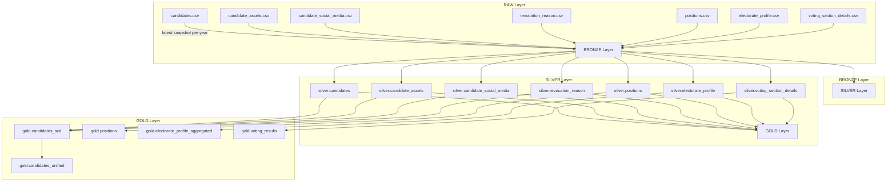

# Brazilian Election Datasets - Medallion Architecture

This repository contains the transformation pipeline for Brazilian Election Datasets following the Medallion Architecture: RAW → BRONZE → SILVER → GOLD.

## Data Lake Structure (RAW Layer)

The raw data is stored in Google Cloud Storage (GCS) with the following folder structure:

```
dataset_name/year/timestamp.csv
```

For each dataset, only the latest CSV per year is ingested into BRONZE via an external table.

## BRONZE Layer

The BRONZE layer creates external tables over the latest snapshots of raw CSV files. This layer ingests the data without transformations and keeps the raw structure intact. All BRONZE tables are accessed via external tables under the `raw` schema.

## SILVER Layer

The SILVER layer applies data cleaning, deduplication, and standardization. Each table is derived from one or more BRONZE tables.

## GOLD Layer

The GOLD layer produces analytics-ready tables, often unifying multiple SILVER tables or aggregating data.

## Table Reference

| Layer  | Table Name                        | Upstream Tables (Source)                                              |
|--------|----------------------------------|-----------------------------------------------------------------------|
| BRONZE | bronze.candidates                 | GCS CSV snapshot (accessed by external table under raw schema)       |
| BRONZE | bronze.candidate_assets           | GCS CSV snapshot (accessed by external table under raw schema)       |
| BRONZE | bronze.candidate_social_media     | GCS CSV snapshot (accessed by external table under raw schema)       |
| BRONZE | bronze.revocation_reason          | GCS CSV snapshot (accessed by external table under raw schema)       |
| BRONZE | bronze.positions                  | GCS CSV snapshot (accessed by external table under raw schema)       |
| BRONZE | bronze.electorate_profile         | GCS CSV snapshot (accessed by external table under raw schema)       |
| BRONZE | bronze.voting_section_details     | GCS CSV snapshot (accessed by external table under raw schema)       |
| SILVER | silver.candidates                 | bronze.candidates                                                     |
| SILVER | silver.candidate_assets           | bronze.candidate_assets                                               |
| SILVER | silver.candidate_social_media     | bronze.candidate_social_media                                         |
| SILVER | silver.revocation_reason          | bronze.revocation_reason                                              |
| SILVER | silver.positions                  | bronze.positions                                                      |
| SILVER | silver.electorate_profile         | bronze.electorate_profile                                             |
| SILVER | silver.voting_section_details     | bronze.voting_section_details                                         |
| GOLD   | gold.candidates_scd               | silver.candidates, silver.candidate_assets, silver.candidate_social_media, silver.revocation_reason |
| GOLD   | gold.candidates_unified           | gold.candidates_scd                                                   |
| GOLD   | gold.positions                    | silver.positions                                                      |
| GOLD   | gold.electorate_profile_aggregated | silver.electorate_profile                                           |
| GOLD   | gold.voting_results               | silver.voting_section_details                                         |

## Architecture Diagram



